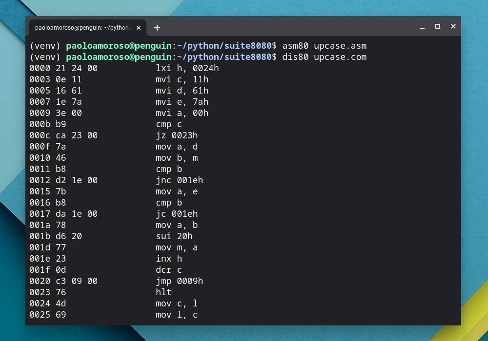

# About the project

This mockup project is a test of using [Repl.it](https://repl.it) for writing documentation with [Jupiter Book](https://jupyterbook.org) and publishing it on [Read The Docs](https://readthedocs.org).

The Markdown documentation and Python sources in this repo are a snapshot of my [Suite8080](https://github.com/pamoroso/suite8080) project. They are just dummy files for getting familiar with the toolchain and process and aren't intended for general use. But if you're curious, help yourself.